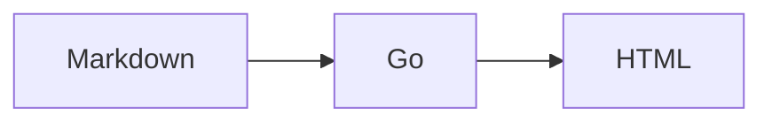

# Jikko Specification v1

## 1. Purpose

Jikko is a filesystem-native convention for structured work in plain Markdown.

Its portable source format is intentionally small:

```text
.md files
    |
    +-- YAML metadata
    +-- Markdown body
    +-- [[references]]
    +-- ![[embeds]]
    +-- inline comments and @mentions
```

Jikko separates portable authored data from runtime capabilities.

> **The files describe what things are and explicitly relate them. The harness determines what can be done with that information.**

## 2. Design principles

1. Markdown files are the source of truth.
2. Ordinary Markdown should work without conversion.
3. Add explicit semantics only when ambiguity matters.
4. Prefer composition over inheritance.
5. Store authored facts; derive what can be reliably derived.
6. Preserve unknown metadata.
7. Keep folders organizational rather than semantic.
8. Keep derived runtime data disposable and reproducible.
9. Git provides audit/history and text merge for the reference harness; Git does not replace Jikko semantics.
10. Do not add a primitive until substantially different workflows demonstrate that it is necessary.
11. Jikko is the authoritative workspace for both humans and agents; relevant work and discussion MUST be recorded in Jikko to become durable project knowledge.

## 2.1 Work model and runtime contract

Jikko work is:

- **Definable:** goals, requirements, acceptance criteria, constraints, and responsibilities can be represented in Documents and Tasks.
- **Discussable:** Documents and Tasks carry durable discussion through comments. Discussion inside Jikko is project knowledge.
- **Trackable:** Task state, responsibility, dependencies, blockers, and progress can be queried and projected through Views.
- **Provable:** claims of completion can cite commits, tests, files, measurements, screenshots, external references, or explicit review approval.
- **Auditable:** authored changes, semantic operations, actor attribution, and historical discussion can be reconstructed from Jikko source plus the reference harness history.

Jikko is the go-to workspace, not an export target for a separate conversation system. Humans and agents MUST read relevant Jikko context before acting and MUST record material goals, questions, decisions, progress, blockers, and evidence in Jikko. An external conversation is not authoritative project state until its material outcome is recorded in a Jikko Document, Task, or comment.

This model does not introduce Claim, Checkpoint, Evidence, Decision, Event, Message, or Chat file types. These are semantics expressed through Task metadata, Document/Task content, comments, links, embeds, and harness history.

The harness MUST expose semantic operations and validation that preserve this model. It MUST keep comments attached to their context, preserve actor attribution, make task state and responsibility queryable, validate resolvable proof references where possible, and surface unmet configured completion requirements. Enforcement MAY be a warning when hard rejection would make ordinary Markdown unusable, but it MUST be deterministic and available to both browser and machine interfaces.

## 3. Fundamental file semantics

Every Jikko source object is a Markdown file with optional YAML frontmatter and a Markdown body.

```text
no type        -> Document
type: task     -> Task
type: view     -> View
type: identity -> Identity
```

### 3.1 Document

A Markdown file without `type` is a Document. A harness MAY accept `type: document`, but MUST NOT require it.

Documents hold information, compose other files, and may contain inline review/discussion. A document can therefore also serve as a durable coordination/message board without introducing Chat or Message primitives.

### 3.2 Task

A Task is explicitly declared with `type: task`.

```md
---
type: task
status: doing
start: 2026-09-15
due: 2026-09-20
tags: [architecture]
assignee: codex
---

# Implement session persistence

Implement the approach described in [[authentication-architecture]].
```

Task metadata is extensible. Common properties include `status`, `start`, `due`, and `tags`. A field such as `status` MUST NOT implicitly turn a document into a task.

`assignee` is responsibility/ownership; an `@mention` is attention. They are not equivalent.

### 3.3 View

A View is explicitly declared with `type: view`. A View is a pure selection/query plus optional presentation hints.

```md
---
type: view
filter:
  type: task
  tags: [architecture]
  status: [todo, doing]
view:
  layout: board
  group: status
  sort: due
---
```

A View MUST NOT use its body for arbitrary narrative content or stored query results. Narrative composition belongs in a Document.

### 3.4 Identity

An Identity is explicitly declared with `type: identity`. Identity is the single actor primitive and is normative in [identity-permissions.md](identity-permissions.md).

An Identity without `members` represents an individual. An Identity with `members` represents a group of identities:

```md
---
type: identity
members:
  - alice
  - codex
---

# Maintainers
```

There are no separate Human, Agent, Group, Team, Person, or Role primitives. Membership is transitive, reverse membership is derived, and cycles or dangling members MUST be reported by the harness.

Identities are addressed directly, such as `@alice`, `@codex`, or `@maintainers`. Identity is not authentication; the harness authenticates a caller and maps it to one individual Identity.

Authorization semantics are defined in [identity-permissions.md](identity-permissions.md). A mutation MUST NOT allow an actor to escalate its own effective authorization.

## 4. Metadata

Jikko uses YAML frontmatter for structured metadata. Unknown properties are allowed and SHOULD be preserved by harnesses.

Tags are ordinary metadata. The core imposes no tag hierarchy, inheritance, or namespace semantics.

Do not store information twice when it can be reliably derived. For example, `@codex` in authored Markdown is sufficient for the harness to derive a mention index; a duplicate `mentions:` property is not required.

## 5. References and embeds

### 5.1 Links

Authored relationships use `[[target]]`.

### 5.2 Universal embeds

Composition uses `![[target]]`. Embeds are file-oriented, not media-type-oriented.

Examples:

```md
![[child.md]]
![[diagram.png]]
![[demo.mp4]]
![[meeting.mp3]]
![[paper.pdf]]
```

A harness chooses presentation from the resolved target. Markdown renders as document/task/view/identity content as appropriate; common media render natively; unknown types fall back to a file card/link.

Embedded Markdown remains a reference to the source file, never a copied representation.

## 6. Mermaid

Fenced Mermaid is supported as source Markdown:

````md

````

The diagram source remains canonical. Browser rendering MUST use a reviewed security configuration. Editing exposes source, not a generated image as canonical data.

## 7. References, rename integrity, and resolution

Jikko prefers readable filenames/paths over mandatory UUIDs. Bare names may resolve when unambiguous; paths disambiguate duplicates.

Renames through the harness are semantic operations. The default rename SHOULD:

1. resolve inbound `[[links]]` and `![[embeds]]`;
2. rename the target;
3. rewrite safely resolvable authored references;
4. run integrity checks and report unresolved/ambiguous references.

A no-rewrite/filesystem-only mode MAY exist, but MUST warn which known references will break.

External renames cannot always be inferred safely. `jikko check` MUST report broken references rather than guess.

Backlinks remain derived data.

## 8. Inline comments and review

Comments are not a separate core file type. Unresolved comments are authored review state inside the Markdown file being discussed.

The design direction is explicit HTML-comment markers around the anchored source plus an in-file thread. The exact serialization MUST be parser-tested before being frozen, but clarity is preferred over abbreviations. The provisional shape is:

```md
The harness should <!--comment:c17-->automatically update references<!--/comment:c17-->
when a file is renamed.

<!--comment-thread:c17
@alice: Should normal links update too?

@codex: Yes, links and embeds.
-->
```

Requirements:

- the anchor physically moves with the Markdown it annotates;
- raw Markdown remains understandable in ordinary editors;
- comments and replies are visible to Git history/diff;
- duplicate comment IDs are detectable;
- deleting commented content requires explicitly dealing with its comment markers/thread rather than silently orphaning discussion;
- the browser presents threads in a sidebar while preserving source-first editing;
- unresolved comments can be queried by the CLI/harness;
- completing a Task with unresolved comments SHOULD warn initially rather than being unconditionally forbidden.

Resolving a comment removes its active markers/thread from current Markdown after the decision is incorporated. Git history retains the historical discussion for audit/review.

Current Markdown therefore contains current unresolved discussion; Git contains historical discussion.

## 9. Identity, mentions, assignment, and notifications

Canonical mention syntax is source-native:

```md
@alice
@codex
@maintainers
```

Namespaces keep human, agent, and group identities unambiguous. A UI MAY render friendlier labels while preserving canonical source.

Mention semantics:

```text
@mention = attention
assignee = responsibility
```

Mentions are authored facts. Mention indexes, inboxes, notification badges, and delivery state are derived by the harness.

The harness SHOULD expose current mentions to browser, CLI, and agents, for example conceptually:

```sh
jikko mentions --for agent:codex --json
jikko watch --for agent:codex
```

Notification delivery is not Markdown source. Browser notifications, SSE, polling, OS notifications, or future adapters are harness capabilities. Disposable runtime state MAY remember which mention event/revision was already delivered; deleting that state may cause duplicate notifications but MUST NOT lose workspace information.

Groups are resolved as groups, not expanded by rewriting source mentions into individual mentions. Group membership changes therefore do not alter the historical authored intent of `@group:name`.

## 10. Git-backed history and audit

The reference harness SHOULD use real Git rather than implement a proprietary history store, diff engine, or three-way merge algorithm.

Git provides:

- immutable historical snapshots/commits,
- diffs,
- rename history,
- revert capability,
- audit history,
- and mature three-way text merge behavior.

Jikko continues to own semantic operations such as reference resolution, rename rewriting, task mutation, comment handling, uploads, and views.

A Jikko workspace remains valid Markdown without Git, but history, audit, historical review, and automatic three-way conflict handling may be unavailable. The reference harness SHOULD make Git initialization easy and warn when history guarantees are unavailable.

Successful semantic mutations SHOULD be commit-able as one logical transaction. For example, uploading an asset and inserting its embed should form one history event rather than unrelated changes.

Actor attribution SHOULD be carried by the mutation context and may be stored in structured Git commit trailers such as `Jikko-Actor` and `Jikko-Operation`. Do not automatically inject `updated_by` into every Markdown file.

## 11. Concurrent edits

Do not introduce CRDT/OT infrastructure until real simultaneous character-level coediting demonstrates a need.

Use optimistic concurrency around file/revision identity:

```text
read base revision A
       |
actor edits
       |
save against A
       |
current still A? -- yes --> save/commit
       |
       no
       v
three-way merge using base + actor edit + current
       |
clean? -- yes --> save/commit
       |
       no
       v
structured conflict for human/agent resolution
```

Git should provide the mature three-way merge machinery where practical; Jikko provides browser/CLI conflict UX. The browser should not expose raw conflict markers by default. Agents should receive deterministic structured conflict output.

SSE may notify open browser sessions when a source file changes externally, reducing avoidable conflicting saves.

## 12. Uploads and asset size

Uploads are ordinary workspace files and, by default, participate in Git history. Browser upload entry points include drag/drop, clipboard paste, `+` insertion, and accessible file picker. Show real byte progress when available and an indeterminate state otherwise.

CLI/agent upload must perform the same core operation, e.g. conceptually:

```sh
jikko upload ./diagram.png
jikko upload ./diagram.png --into architecture.md --json
```

The reference harness MUST impose a configurable maximum upload size to avoid accidentally placing impractically large binary files into ordinary Git history. The initial limit should be chosen from testing rather than premature optimization.

**Open design question:** large binary asset storage. Git LFS or another local/remote large-file mechanism may eventually be useful, but it is deliberately not a v1 dependency. Any future design must consider local hosting, portability, deletion/garbage collection, and the complexity of introducing a second storage system.

## 13. Harness and derived data

A harness interprets a Jikko workspace and may provide search, backlinks, reference resolution, autocomplete, rendering, query evaluation, views, notifications, history UI, indexes, and caches.

Derived data MAY be stored under `.data`, but `.data` is not portable source and is not standardized.

Required invariant:

```text
delete derived data
+
rebuild from Markdown (+ Git history where the feature explicitly concerns history)
=
equivalent runtime state
```

Derived data SHOULD normally be excluded from version control.

## 14. View purity and composition

Views remain pure queries. Documents provide narrative composition. Do not add view inheritance, dashboards, master views, projects, or templating systems as core primitives.

Composition uses `![[...]]`; composition, never inheritance, remains a design constraint.

## 15. Folder semantics

Folders organize files but carry no Jikko semantics. Meaning comes from content and metadata, not directory placement.

## 16. Rendering safety

A rendering harness MUST detect recursive embed cycles and stop expansion safely.

## 17. Non-goals for v1

The following are deliberately not separate core primitives:

- Project
- Sprint
- Dashboard
- Database
- Collection
- Milestone
- Person
- Agent
- Message
- Chat
- Claim
- Checkpoint
- Evidence
- Decision
- Event
- Comment
- Department
- Workspace hierarchy
- View inheritance
- Tag inheritance
- Materialized view results
- Mandatory UUIDs
- standardized `.data`
- general templating language
- rich embed modifier syntax
- CRDT/OT collaboration
- Git LFS/large-file subsystem

`Identity` is the single actor primitive. Individual and group actors are expressed through Identity membership rather than separate Human, Agent, Group, Team, Person, or Role types.

## 18. Core summary

```text
DOCUMENT = information, composition, and durable discussion surface
TASK     = information with explicit actionable semantics
VIEW     = pure selection plus presentation hints
IDENTITY = individual or group actor for addressing, assignment, and authorization

LINK     = authored relationship
BACKLINK = derived relationship
EMBED    = composition
COMMENT  = authored durable discussion/review state inside Markdown
MENTION  = authored request for attention
ASSIGNEE = authored responsibility
GIT      = reference harness history/audit/merge substrate
.data    = disposable harness-specific index/cache/delivery state
```

## 19. Design test

Exercise the format against substantially different workflows before expanding it further: software development, personal tasks, research, teaching, sales, events, long-form writing, CRM, home renovation, and recurring operations. Add primitives only when real failures demonstrate missing semantics.
