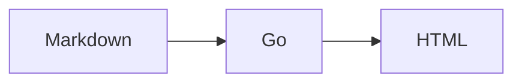

# Jikko UX and Collaboration Plan

This document captures product decisions and open questions. It is a plan, not a promise that every item belongs in the core format.

## Editing model

Jikko should feel directly editable without changing the fact that Markdown files are the source of truth.

- Render Markdown normally until the user interacts with it.
- Direct editing should mutate the source Markdown through the Go harness.
- Keep raw/source editing available.
- Use `+` and `/` as fast insertion affordances without introducing an internal block database.
- Browser mutations and CLI mutations must share the same Go semantics.

### Embedded Markdown documents

`![[file.md]]` renders the referenced Markdown document inline.

Embedded Markdown must be visually distinguishable from local content with a subtle border/container.

When an embedded document is selected:

1. reveal the literal source anchor, e.g. `![[file.md]]`;
2. provide an explicit action to open the embedded file;
3. provide an action that opens a modal editor for the source file without leaving the current document.

Saving that modal edits `file.md`, not a generated copy in the parent document. SSE then updates all rendered instances.

## Universal embeds

The embed syntax is file-oriented rather than media-type-oriented:

```md
![[diagram.png]]
![[demo.mp4]]
![[meeting.mp3]]
![[paper.pdf]]
![[child.md]]
```

The harness chooses a renderer from the resolved file type. Unknown file types fall back to a file card/link.

This should remain extensible without adding a new core entity type for every media format.

## Mermaid

Support fenced Mermaid source as ordinary Markdown content:

````md

````

The source remains text in the Markdown file. The browser renders the diagram. Editing exposes the Mermaid source rather than storing generated diagram output as canonical data.

Mermaid rendering must use an explicitly reviewed security configuration because diagram source is workspace content.

## Rename integrity

Renames must be semantic operations in the Go harness, not blind filesystem moves.

Target command:

```sh
jikko rename old-name new-name
```

Before mutation, resolve inbound `[[links]]` and `![[embeds]]` using the same resolver used by `jikko check`.

Default behavior: rename the file and rewrite resolvable authored references atomically enough that the workspace is not intentionally left broken.

Provide an explicit no-rewrite mode for users who want a filesystem-only rename. It must warn and list references that will become broken.

After any rename, run/reference the integrity checker and report unresolved or ambiguous references.

The harness should also detect external filesystem renames during scanning/checking and report newly broken references; it cannot safely infer every external rename.

## Uploads

Uploads are ordinary files placed in the workspace and optionally embedded into Markdown.

Browser entry points:

- drag a file onto the editor;
- paste supported clipboard files/images;
- click the `+` insertion control and choose File/Image/Media;
- file picker fallback for accessibility.

Show upload progress. Do not fake progress: use actual bytes transferred when the transport exposes them, otherwise show an indeterminate state.

After upload, insert the appropriate `![[path]]` at the selected document position unless the user chose attachment-only behavior.

Default attachment location can be `assets/`, but storage location is configuration, not a semantic property of that directory.

### Agent/CLI upload

Agents must be able to perform the same operation without the browser:

```sh
jikko upload ./diagram.png
jikko upload ./diagram.png --into architecture.md
```

The first copies/imports the file according to workspace attachment policy. The second additionally inserts an embed in the target Markdown document. Machine-facing output should support `--json` and report final path, bytes, and changed document(s).

## Identity: separate the concepts

Do not add an `Agent` core document type yet. Identity is an actor/runtime concern unless a real workflow proves it belongs in portable Markdown.

We need to distinguish four concepts:

1. **Identity** — who is performing an operation (`human:alice`, `agent:codex`, etc.).
2. **Attribution** — who performed a mutation and when.
3. **Presence** — who is currently connected/working; ephemeral and therefore not Markdown source.
4. **Communication** — durable or ephemeral messages between actors.

Initial direction:

```sh
jikko --actor agent:codex ...
```

or an equivalent environment/config identity for repeated commands.

The Go core should accept actor context on mutations even before a collaboration backend exists. This avoids retrofitting identity into every mutation later.

Do not automatically write `updated_by` into every Markdown file. Attribution can be derived from a local operation log or version-control history when available. If a workflow needs authored ownership, `owner:` remains ordinary user metadata.

### Communication questions to resolve before implementation

- Are messages durable workspace knowledge or ephemeral coordination?
- Should durable messages simply be Markdown documents/comments, or a separate append-only event stream?
- How are actors addressed (`@name`, stable ID, runtime ID)?
- How do multiple machines authenticate the same actor?
- Which communication data must survive copying the workspace folder?
- What is the conflict model when two actors edit the same Markdown file?

Do not build chat before answering these.

## UX references

### Notion: steal direct manipulation, not the block database

Useful patterns: direct editing, `+`, slash insertion, drag handles/reordering, drop-to-upload, contextual actions. Jikko should not reproduce Notion's block storage model merely to reproduce these interactions.

### Obsidian: strongest conceptual match for source fidelity

Live Preview is especially relevant: rendered Markdown remains editable, with syntax becoming visible around the active editing context. Jikko should study this closely for the transition between rendered and source representations.

Obsidian-style file embeds also validate the idea that the same link/embed vocabulary can cover notes and attachments.

### Outline: useful server-first editor reference

Outline is worth studying because it combines a polished document editor with slash insertion, embeds, Mermaid diagrams, keyboard-driven navigation, attachments, and agent access. Its Mermaid UX switches between diagram and source, a good fit for Jikko's source-first model.

### Other apps

Continue evaluating local-first/block tools such as Anytype, AFFiNE, and Logseq, but judge interactions against one question: **does this UX remain simple when Markdown files, not blocks/database records, are canonical?**

## Distribution

### Homebrew first path

Start with a project-owned tap rather than waiting for acceptance into `homebrew/core`.

Required work:

1. Choose and add an open-source license.
2. Create a stable tagged release (for example `v0.1.0`).
3. Ensure release source is immutable and dependencies are reproducible (`go.sum`).
4. Add CI that runs `go test ./...` and a functional CLI test.
5. Create a `homebrew-tap` repository with `Formula/jikko.rb`.
6. Formula builds the tagged Go source and installs the `jikko` binary.
7. Add a Homebrew formula test that exercises real behavior, not only `jikko --version`.
8. Test install from source and audit the formula.
9. Document the one-command tap installation in README.

Later, consider submission to `homebrew/core` only after Jikko has a stable release, public project presence, maintenance history, and satisfies Homebrew's acceptance requirements.

## Near-term dependency order

```text
safe Markdown mutation primitives
        |
        +--> rename + reference rewrite/check
        +--> upload + attachment policy
        +--> direct editor mutations
        |
universal renderer
        +--> Markdown embeds
        +--> images/audio/video/PDF/file cards
        +--> Mermaid
        |
browser UX
        +--> embedded-document border/source actions
        +--> + / slash insertion
        +--> drag/drop + paste + upload progress
        +--> direct editing

actor context in Go mutations
        |
        +--> attribution
        +--> presence (ephemeral)
        +--> communication design
```

Keep these capabilities in the Go core wherever they represent workspace semantics so the browser and AI/CLI interfaces cannot drift apart.
